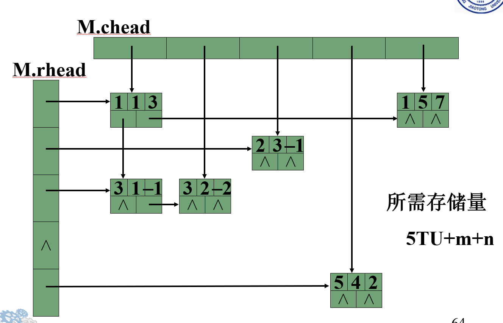

# 数组

## 数组的定义

    数组是有限个数据元素的集合（都具有相同特性）
    每个数组元素名由数组名和下标组成

## 操作特点

    只有引用型操作，没有加工型（插入和删除）操作；

## 压缩储存

    压缩的含义：
    1.为多个值相同的元素只分配一个存贮空间；
    2.零元素不分配存贮空间。

    难点：存贮地址计算公式

## 特殊矩阵

    值相同元素或零元素分布有一定规律的矩阵。
    例如：三角矩阵，对角矩阵

## 稀疏矩阵

    值相同元素或零元素分布没有规律的矩阵。

    假设 m 行 n 列的矩阵含 t 个非零元素，则称t/(m+n)为稀疏因子
    通常因为稀疏因子小于 0.05 为稀疏矩阵

## 稀疏矩阵的存储方法

- 顺序储存：
  1. 三元组表示
  2. 行逻辑连接
  3. 带辅助向量的二元组表示
  4. 伪地址表示
- 连接储存：
  1. 带行指针向量的单链表示法
  2. 十字链表
  3. 正交表
- 散列储存

## 三元组表示法

    每个结点对应一个元素：
    分别 行下标 列下标 值
    结点间的先后顺序按矩阵的行优先顺序排列

<font color=red> 三元组的转置 </font>
关键是对转置后的排序
第一种 ： 就按列来进行外层循环，先找第一列的，再找第二列...
第二种 ：快速转置：在转置前，应先求得 M 的每一列中非零元的个数
从而快速确定每一列第一个非零元素的位置

```cpp
{
    cpot[1] = 1;
    cpot[col] = cpot[col-1]+num[col-1]
}
```

## 行逻辑连接

    简单讲就是在三元组的表示上增加了每行第一个非零元在三元组中的位置

## 带行向量指针的单链表表示法

    将矩阵的每一行的非零元素链接成一个单链表，每个结点包括三个域：
    列下标、非零元素值、指针

## 十字链表法

    将行链表与列链表结合起来的表示方法



# 广义表

## 定义

    广义表是线性表的推广，也称为列表（List），是n个单元素或子表所组成的有限序列
    大写字母表示广义表的名称，小写字母表示原子
    第一个元素称为表头，剩余的组成的表称为表尾
    是递归的线性结构

## 具体概念

    长度定义为最外层包含元素个数
    深度定义为所含括弧的重数

    递归表的深度是无穷值，长度是有限值
