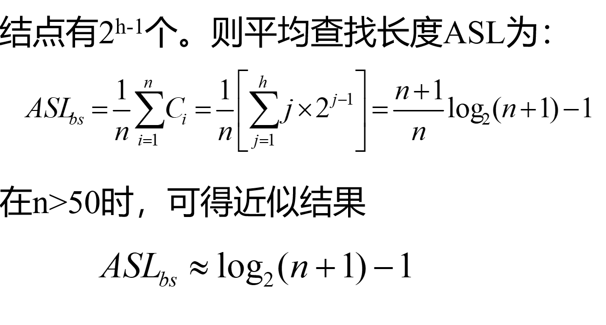
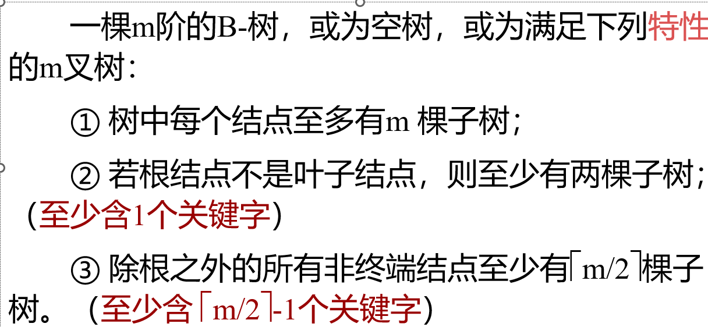
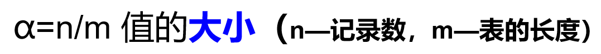

# 查找

## 静态查找表

### 顺序表

从后往前查时，将表的第一个设为 key，这样表中没有时返回的是 0
时间性能：不成功时为 $n+1$
成功时为$(n+1)/2$
_都是按从后往前查找来说的_

### 有序表

折半查找
n 个结点的判定树的深度与 n 个结点的完全二叉树的深度相同。
时间性能：
成功时：比较次数等于该路径上内部结点的个数
不成功时：比较次数等于该路径上结点个数。不超过$log_2{n}+1$

### 索引顺序表

    又称分块查找

每一块的关键字不一定有序，但是块与块之间是绝对的大于或者小于

## 动态查找表

有时在查询之后，还需要将“查询”结果为“不在查找表中”的数据元素插入到查找表中；或者，从查找表中删除其“查询”结果为“在查找表中”的数据元素

 _简而言之就是边查询边操作 （map）_

### 二叉排序树

    创建
    查询
    删除

当删除时左右子树都不空：

1. 找到左子树的最右孩子（作为 sentinel）
2. 直接把要删除的结点的 data 值等于 sentinel 的值
3. 然后将 sentinel 的前驱的右孩子直接连接 sentinel 的左孩子

### 平衡二叉树

平衡因子：
二叉树上任一结点的左子树深度减去右子树深度的差值，称为此结点的平衡因子

### B 树

## 哈希表

1. 直接定址法（哈希函数为线性函数）
2. 数字分析法
3. 平方取中法
4. 折叠法
5. 除留余数法
6. 随机数法

### 处理冲突

1. 开放定址法：对冲突的 key 值求一个增量$d_i$
   1. 线性探测再散列：$d_i 为 c*i$
   2. 平方探测再散列：$d_i 为 1^2,- 1^2....$
   3. 随机探测再散列: $d_i 为 i*H(key) 就是再哈希一遍$
2. 链地址法：对每个关键字都建一个链表来存
3. 再哈希法
4. 公共溢出表：所有冲突的 key 全部丢进去
   
