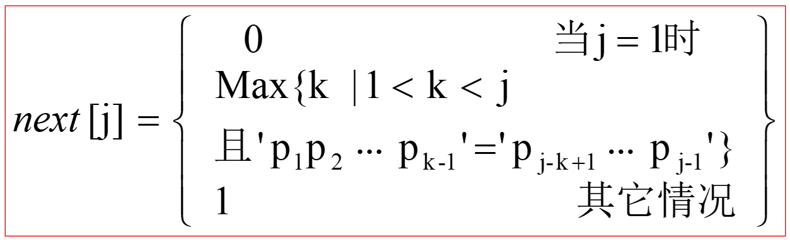

# 串的算法

## 定义 ： s=‘a1a2a3…an’ (n≥0)

    串中字符个数称为串的长度

    由一个或多个空格组成的字符串叫空串

    子串在主串中的位置则以子串的第一个字符在主串中的位置来表示

## 函数要点

    都是从 1 开始计数
    Index (S, T, pos) ： 返回pos后第一个与T匹配的位置
    Replace (&S, T, V) ：用V替换T，但是不重叠

## 三种表示方法

    串的定长顺序存储表示
        紧缩 非紧缩
    串的堆分配存储表示
    串的块链存储表示：
        存储密度 = 数据元素所占位 / 实际分配的大小

## KMP

_简单理解，每个元素的前的串最长前缀和后缀匹配_
在匹配到第一个元素还失败后便使匹配串 i++

有一个改进版，带 nextval 的版本：
nextval 是为了方便出现模板串中出现 _aaaab_ 这种情况的
当出现这种情况时当最后一个 a 匹配失败时可以直接退回 0，便 nextval 的简单理解：当 s[i] = s[i-1]时，nextval[i] = nextval[i-1];
